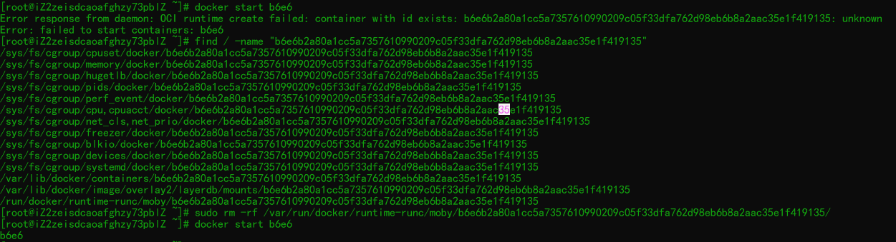

1.记录容器启动失败

    response from daemon: OCI runtime create failed: container with id exists:XXX:unknown
    问题原因：
    解决方法
    1、执行
    `find / -name "XXX"`
    2、清除运行文件：
    `sudo rm -rf /var/run/docker/runtime-runc/moby/XXX/`
    3、重新启动
    docker start 8adf

